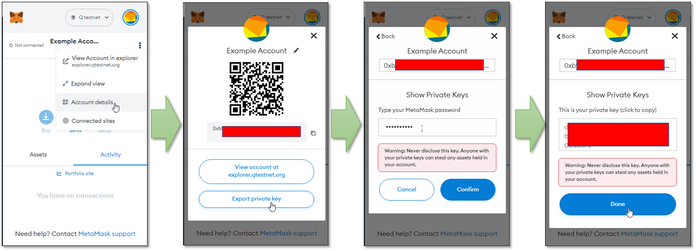

# Q_Blockchain Importing a Metamask Account into Q Client

About: This tutorial explains how to import a Metamask Account into the Q Blockchain client. Motivation came from the ITN program, where some users accidentally registered to the program not with a Q Client generated wallet but with their default Metamask generated. 

If you like this tutorial or find it helpful to receive ITN rewards, please donate Q Tokens to: `0xf807838B8cd7bbA00736B2CE4BB81D9a7a5e73AC`

**Note:** This guide is of educational purpose and assumes high level of technical understanding. You are touching private keys of your metamask so make sure to backup any funds to a secured separate wallet first.  

## Step 1: Export Private Key From Metamask

You can export accounts which are generated from Metamask with the export function. 

**Note:** You cannot export private keys of connected hardware wallet, like Trezor or Ledger etc. 

Click the three dots, see the account details, export private key, enter metamask password, copy private key. 



**Note:** Make sure no has access to your private key - **risk of Loss of funds!!!**

## Step 2: Start Q Validator Node without unlocking account and mining

It is assumed you have docker and docker compose installed on your system. You can check versions with

- `$ docker --version`  should obtain something like `Docker version 20.10.22, build 3a2c30b` 
- `$ docker compose version`  should obtain something like `Docker Compose version v2.14.1`

In case you get a permission error, try to check version with `sudo`.
In case you use old docker-compose check version with `$ docker-compose --version`.

Follow the steps in the official Q Blockchain guide until ste

Clone Q Blockchain testnet public tools repository onto your machine

`$ git clone https://gitlab.com/q-dev/testnet-public-tools`

Go into the validator directory

`$ cd testnet-public-tools/testnet-validator/`

Backup original `docker-compose.yaml` with 

`$ cp docker-compose.yaml bak_docker-compose.yaml`

Edit the file `$ nano docker-compose.yaml` and remove the lines

```
"--unlock=$ADDRESS",
"--password=/data/keystore/pwd.txt",
"--mine",
"--miner.threads=1",
"--miner.gasprice=1",
 ```

After the modification, `entrypoint` inside `docker-compose.yaml` looks like this

```
entrypoint: [
      "geth",
      "--testnet",
      "--datadir=/data",
      "--syncmode=full",
      "--bootnodes=$BOOTNODE1_ADDR,$BOOTNODE2_ADDR,$BOOTNODE3_ADDR",
      "--verbosity=3",
      "--nat=extip:$IP",
      "--port=$EXT_PORT",
      "--rpc.allow-unprotected-txs"
    ]
```

 This will start the Q Client wihtout trying to access a wallet file and also without acting as a validator. 

Start the Q Client with `$ docker compose up -d`.

Wait a few seconds for the client to start. 

Access the Geth Console with `$ docker compose exec testnet-validator-node geth attach data/geth.ipc`

**Note:** Use `$ sudo docker compose` in case of permission error or `$ sudo docker-compose` in case you use old version of docker-compose.

You should now see a welcome message to geth console like this

```
Welcome to the Geth JavaScript console!

instance: Q-Client/v1.2.2-stable/Geth/v1.10.8-stable-c61c079e/linux-amd64/go1.16.15
at block: 57203 (Mon May 09 2022 18:36:27 GMT+0000 (UTC))
 datadir: /data
 modules: admin:1.0 clique:1.0 debug:1.0 eth:1.0 gov:1.0 govPub:1.0 miner:1.0 net:1.0 personal:1.0 rpc:1.0 txpool:1.0 web3:1.0

To exit, press ctrl-d
>
```

You are now ready for the final step

## Step 3: Import private key into Q Client

Make sure you have the metamask private key from step 1 available via copy & paste or copy from paper note.

In this guide example: `d************************************e`

Think about a secure password. In this guide example: `secure-password-123`

In the geth console type

`personal.importRawKey("d************************************e", "secure-password-123")`

make sure to use `" "` with key and password.

The output should be your public wallet address starting with `0x`. Example: `"0xb***c"`. 
Compare this with your metamask account public wallet address from Step 1 and they should be identical. 

Now, exit the geth console with `Ctr + d`

Check folder `keystore` was generated inside `testnet-validator` folder. Inside `testnet-validator` do `ls -l` and confirm it is there. 

Go into the folder and check keystore file was generated:

`$ cd keystore/`

`$ ls- l`

And the directoy should contain a file starting with `UTC`, example: `UTC--2023-01-01T14-58-24.892262090Z--b******************c`

Note that the last part of keystore file is your wallet address without `0x`. 

Congratulations, you can now continue with the official setup guide and use public address from metamask ass validator address.

##Step 4 Cleanup

Shutdown the client with 

Go back inside the `testnet-validator` folder. Shutdown the client with 

`$ sudo docker compose down`

Restore the original `docker-compose` file with 

`$ mv bak_docker-compose.yaml docker-compose.yaml`

Double check that `entrypoint` inside `docker-compose.yaml` looks like this

```
entrypoint: [
      "geth",
      "--testnet",
      "--datadir=/data",
      "--syncmode=full",
      "--bootnodes=$BOOTNODE1_ADDR,$BOOTNODE2_ADDR,$BOOTNODE3_ADDR",
      "--verbosity=3",
      "--nat=extip:$IP",
      "--port=$EXT_PORT",
      "--unlock=$ADDRESS",
      "--password=/data/keystore/pwd.txt",
      "--mine",
      "--miner.threads=1",
      "--miner.gasprice=1",
      "--rpc.allow-unprotected-txs"
    ]
```


